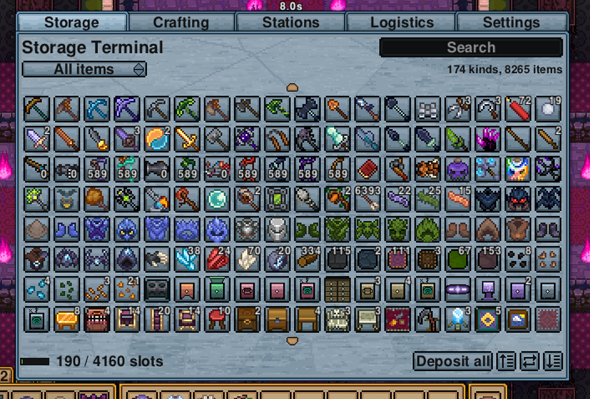

# Arcane Storage


A storage and crafting mod for [Necesse](https://necessegame.com). Necesse gives you plenty of chests. It does
not give you a way to see inside all of them at once. Arcane Storage joins your containers into one network and
puts a single screen in front of it, so you search one list instead of opening twenty lids, and craft from
everything you own at once.

**[Player guide](docs/wiki/README.md)** — what each item does and how to build a network.

## What it offers



**One inventory.** Every container on the network appears as a single searchable grid. Type to filter it, sort
it by category, name or amount, and narrow it to stackable materials or one-off gear. Withdraw and deposit
without going anywhere.

**Crafting from all of it.** Install crafting stations into a Station Unit and the terminal offers their
recipes, drawing materials from anywhere on the network. Recipes are searchable and can be grouped by category
or listed flat.

**Capacity you extend rather than outgrow.** Storage Units hold 40 stacks at the base tier and 320 at the top.
Add as many as you like and join them with Arcane Conduit. There is no fixed ceiling on the network.

**Import and export buses.** Place a bus against any container to move items in or out automatically, with a
per-bus item filter and a keep-this-much rule. Every bus is named and listed on a Logistics tab that reports
which ones are working.

**Wireless access.** A Wireless Terminal opens your network from across the base. Access Points bring distant
storage onto the network over a band, so a chest room on the other side of the map behaves as though conduit
reached it.

**Four tiers.** Units, Station Units, Transceivers and Base Stations all upgrade through base, Demonic,
Tungsten and Fallen rungs, using the materials and stations the game already has you gathering at that point.
Upgrading happens in place and keeps the contents.

**Two interface themes**, a slate and a dark one, or the game's own look if you prefer it.

The interface deliberately follows the conventions of Terraria's
[Magic Storage](https://github.com/blushiemagic/MagicStorage). Many Necesse players come from Terraria, and
reusing a layout they already know beats inventing a new one.

## Building

Requires JDK 17 and a local Necesse installation. The build reads both from `gradle.properties`, which is
machine-specific and not tracked:

```bash
cp gradle.properties.example gradle.properties
# edit necesseGameDir and org.gradle.java.home to match your machine
make build          # produces build/jar/ArcaneStorage-<gameVersion>-<modVersion>.jar
make run            # launch the game with the mod loaded (needs Steam running)
make dev            # launch a second client for multiplayer testing
make server         # launch a local dedicated server with the mod
make doctor         # check that the JDK and game install are found
```

`make help` lists everything. The Makefile wraps Gradle so output streams live and builds cannot silently
hang; run it in preference to `./gradlew` directly.

## Tests

```bash
make test           # 57 JUnit tests: network traversal, and the release conventions
make pytest         # 273 scenarios against a real headless dedicated server
```

`make pytest` drives a real server with a real player and this mod's own container, including a scenario that
restarts the server to prove the save round-trips. It runs through the
[Necesse Headless Harness](https://github.com/EliasVahlberg/necesse-headless-harness), a separate project.

Nothing automated draws a pixel, so every UI change is unverified until someone looks at it. Those checks live
in [docs/QA_BACKLOG.md](docs/QA_BACKLOG.md).

Contributors should read [CONTRIBUTING.md](CONTRIBUTING.md). If you are pointing an AI coding agent at this
repo, [AGENTS.md](AGENTS.md) is written for that.

## Compatibility

Targets Necesse 1.3.2. Not clientside: the mod registers content, so the server and every connecting client
need it installed.

## Licensing

Code and art are MIT licensed. See [LICENSE](LICENSE).

The sprites under `src/main/resources/` are original work rather than edits of Necesse's own art, so the MIT
grant covers them too. Screenshots in `docs/` necessarily show the game's art, which remains Fair Games
Studio's.

## Acknowledgements

- [DrFair / Fair Games Studio](https://necessegame.com) for Necesse and its modding API.
- [Magic Storage](https://github.com/blushiemagic/MagicStorage) by blushiemagic, whose interface design this
  follows.
- [UltraStorage](https://github.com/AizSave/UltraStorage) by AizSave, prior art for large-capacity containers
  in Necesse.
