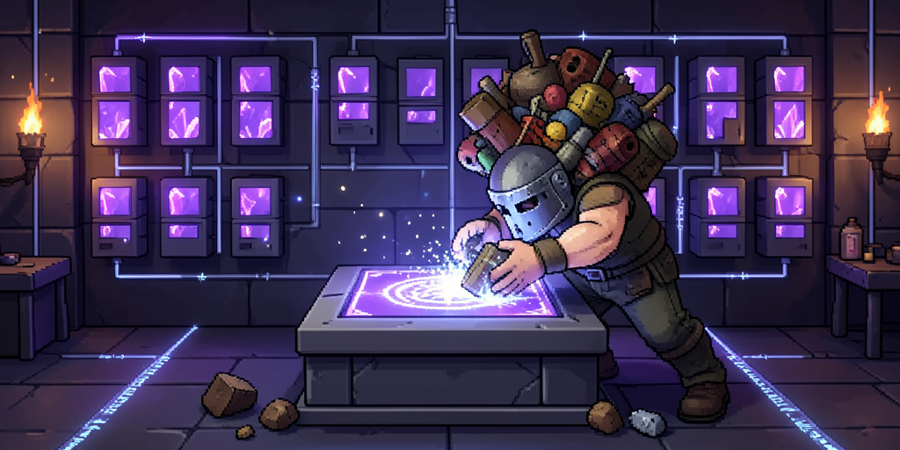

# Arcane Storage



A storage and crafting interface mod for [Necesse](https://necessegame.com).

Necesse gives you plenty of chests. It does not give you a way to see what is
in all of them at once. Arcane Storage adds a single access point that presents
every connected container as one searchable inventory, and lets you craft
directly from all of it.

> **Status: early development.** Not yet released, not yet on the Workshop.
>
> **On the art:** the sprites and the banner are generated with a local AI image
> pipeline and then checked by hand against a fixed nine-colour palette. They are
> original work rather than edits of Necesse's own art. Said plainly here because
> people reasonably want to know.
>
> See [docs/ROADMAP.md](docs/ROADMAP.md) for what is planned and what works,
> [docs/QA_BACKLOG.md](docs/QA_BACKLOG.md) for checks that need a live session,
> and [docs/SPRITES.md](docs/SPRITES.md) for the art the mod needs.

## Planned features

- **Unified storage view** — one panel showing the contents of every connected
  container, not one chest at a time.
- **Search** — type to filter across everything you have stored.
- **Unified crafting** — craft from materials anywhere in the network, with the
  crafting stations you have connected.
- **Recipe search** — find a recipe by name and see whether you can afford it.
- **Expandable capacity** — add containers to grow the network rather than
  hitting a fixed cap.
- **Sorting and filtering** — by category, and per-container item filters.

The interface deliberately follows the conventions of Terraria's
[Magic Storage](https://github.com/blushiemagic/MagicStorage). Many Necesse
players come from Terraria, and reusing a layout they already know is more
valuable than inventing a new one.

Longer-term ideas, borrowed from Minecraft's
[Applied Energistics 2](https://github.com/AppliedEnergistics/Applied-Energistics-2),
are listed at the end of the roadmap. They are aspirational, not commitments.

## Building

Requires JDK 17 and a local Necesse installation. The build reads both from
`gradle.properties`, which is machine-specific and not tracked:

```bash
cp gradle.properties.example gradle.properties
# edit necesseGameDir and org.gradle.java.home to match your machine
make build          # produces build/jar/ArcaneStorage-<gameVersion>-<modVersion>.jar
make run            # launch the game with the mod loaded (needs Steam running)
make dev            # launch without Steam
make server         # launch a local dedicated server with the mod
make doctor         # check that the JDK and game install are found
```

### Tests

```bash
make test           # unit tests over the network traversal
make pytest         # the whole suite against a real headless server, including a save/load restart
```

`make pytest` is the automated suite: 53 tests driving a real dedicated server, with a real
player and this mod's own container, including one test that restarts the server to prove the
save round-trips. `make test` is JUnit over the traversal logic alone and needs no game.

Nothing automated draws a pixel, so every UI change is unverified until someone looks at it;
those checks live in [docs/QA_BACKLOG.md](docs/QA_BACKLOG.md).

Contributors should read [CONTRIBUTING.md](CONTRIBUTING.md); if you are pointing an AI
coding agent at this repo, [AGENTS.md](AGENTS.md) is written for that.

`make help` lists everything. The Makefile wraps Gradle so that output streams
live and builds cannot silently hang; run it in preference to `./gradlew`
directly.

## Compatibility

Targets Necesse 1.3.2. Not clientside — because the mod registers content, both
the server and connecting clients need it installed.

## Licensing

Code is MIT licensed; see [LICENSE](LICENSE).

Art assets under `src/main/resources/` that are derived from Necesse's own
sprites (recolored, sliced, or recombined) remain the property of Fair Games
Studio and are included here under the same terms that permit Necesse texture
mods generally. They are not covered by the MIT grant, and should not be reused
outside of a Necesse mod. Original art authored for this project is MIT along
with the code.

## Acknowledgements

- [DrFair / Fair Games Studio](https://necessegame.com) for Necesse and its
  modding API.
- [Magic Storage](https://github.com/blushiemagic/MagicStorage) by blushiemagic,
  whose interface design this follows.
- [UltraStorage](https://github.com/AizSave/UltraStorage) by AizSave, prior art
  for large-capacity containers in Necesse.
