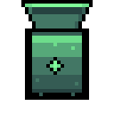
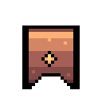

# Buses

A bus sits next to an ordinary container and moves items between that container and the network. It does the
walking so you do not have to.

Both kinds cost 20 [Any Log](https://necessewiki.com/Any_Log) and 10
[Iron Bar](https://necessewiki.com/Iron_Bar) at a [Workstation](https://necessewiki.com/Workstation).

## Import Bus

Takes items **out of** the container and puts them **into** the network.

The usual first one goes next to the chest you empty your pockets into when you get home. Drop everything in
the chest, walk away, and it ends up sorted into your network.

## Export Bus

Takes items **out of** the network and puts them **into** the container.

Useful for keeping something topped up. An export bus set to wood, next to a chest by your building spot,
means that chest always has wood in it.

## Placing one

A bus needs two things. It must touch the network, through a conduit or by being next to a unit or the
terminal. And it must be directly next to the container it serves, in one of the four directions, not
diagonally.

The bus sprite shows which way it is facing once it has found a container. If it looks unattached, it has not
found one, and the usual reason is that the container is diagonal rather than beside it.

A container wider than one tile works from any of its sides.

## Rules

Click a bus to open it. Every bus starts with no rules, which means everything is allowed.

- **Item rules** let you list what may pass. An import bus with a rule for ore moves only ore and leaves the
  rest in the chest.
- **Category rules** work the same way but for a whole category at once.
- **A limit** on a rule stops the transfer once the network holds that many. An export bus with a limit of 200
  on wood keeps the chest supplied up to 200 and then stops.

## Names

Every bus gets a number when you place it, so your first import bus is Import Bus 1. That number is yours for
good and does not change when you break another bus.

You can rename any bus to something you will recognise, like Farm or Smelter. The name shows up in the
Logistics tab, which is where a large base becomes readable instead of being a list of numbers.

## The Logistics tab

Open the terminal and go to Logistics. Every bus is listed with its name, what it is attached to, and whether
it is working.

A bus that has a problem says so here. The common ones are having no container next to it, or having a rule
that no longer matches anything.
