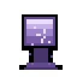
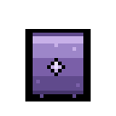
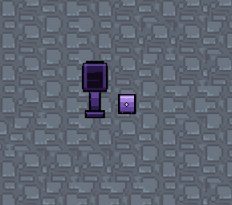
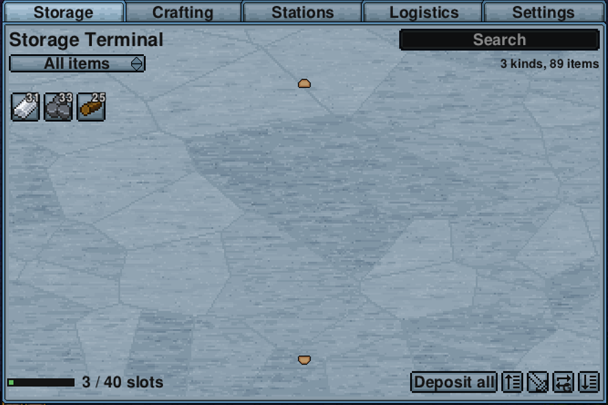
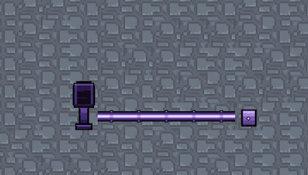
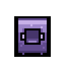
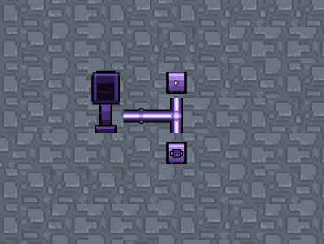
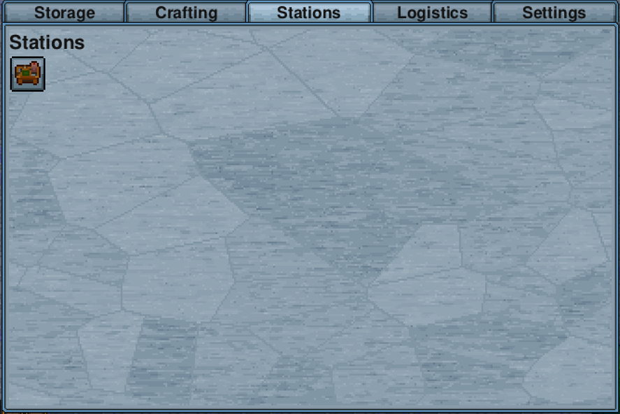

# Getting started

You can build your first working network with 80 logs, 21 iron bars and a
[Workstation](https://necessewiki.com/Workstation).

## Step one, the terminal

Craft a **Storage Terminal** at a Workstation from 80 [Any Log](https://necessewiki.com/Any_Log) and 20
[Iron Bar](https://necessewiki.com/Iron_Bar), then place it somewhere you will walk past often.

The terminal is the screen you open. On its own it holds nothing, so if you open it now it is empty. That is
expected.

## Step two, a storage unit

Craft an **Arcane Storage Unit** at a Workstation from 40 Any Log and 10 Iron Bar. Place it directly next to
the terminal.

Open the terminal again and it now has 40 slots. Put something in. That is a working network.

Open it and the Storage tab lists what the unit is holding, with the slot count along the bottom.

A unit next to the terminal is connected. A unit further away needs conduits, which is the next step.

## Step three, conduits

**Arcane Conduits** carry the network across the floor. Four of them cost one Iron Bar and no crafting
station, so you can make them in your inventory.

Lay a line of conduit from the terminal and put units at the end of it. Anything joined by conduit is on the
same network. A gap in the line breaks it, so if a unit stops showing up, look for the missing tile.

Conduits go under floors and are walked over normally. You do not need to leave space around them.

## Step four, crafting

A **Station Unit** holds crafting stations. Craft one at a Workstation for the same cost as a Storage Unit,
connect it to the network, and open it. It has one slot at the base tier.

Conduit branches, so one run can feed a storage unit and a station unit at once.

Put a [Workstation](https://necessewiki.com/Workstation) or an
[Iron Anvil](https://necessewiki.com/Iron_Anvil) into that slot. 

Now open the terminal and go to the
**Crafting** tab. Everything that station can make is listed, and the materials come from anywhere on the
network.

You do not need to stand near the station. It only needs to be installed in a Station Unit on the network.

## What to build next

Once that works, the useful next steps in rough order:

1. **More Storage Units.** There is no cap. Add units and conduit as you fill up.
2. **An Import Bus** next to the chest you dump things into when you get home. See [Buses](buses.md).
3. **Upgrade a unit** when 40 slots per unit starts to feel small. See [Tiers](tiers.md).
4. **A Wireless Terminal** once you have beaten the Demonic tier, so you can reach your base from anywhere.
   See [Reaching further](wireless.md).

## If something is not showing up

- **A unit is missing from the terminal.** Follow the conduit line from the terminal to the unit and look for
  a gap.
- **The crafting tab is empty.** Check the station is inside a Station Unit rather than placed on the floor,
  and that the Station Unit is connected.
- **A bus is not moving anything.** A bus needs to be directly next to the container it serves, and the
  container needs to be next to it rather than diagonal. The bus sprite shows which way it is facing.
