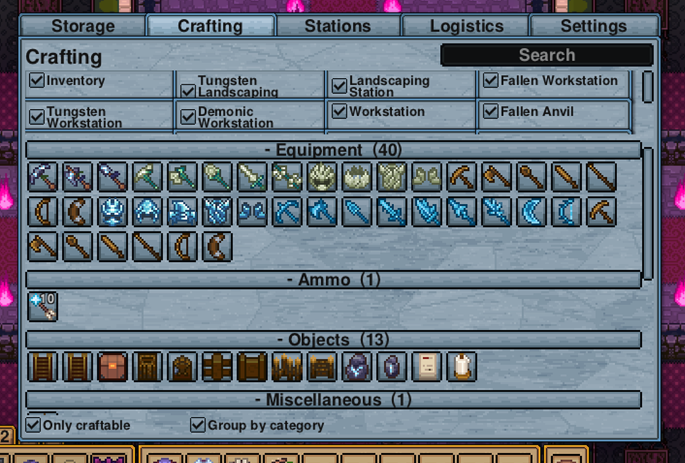
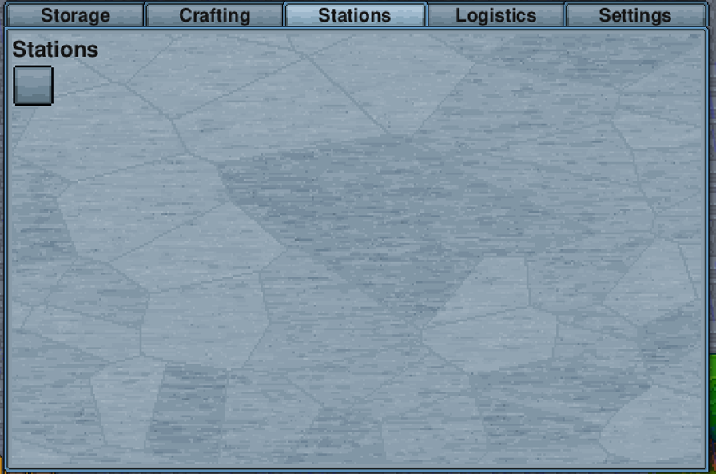
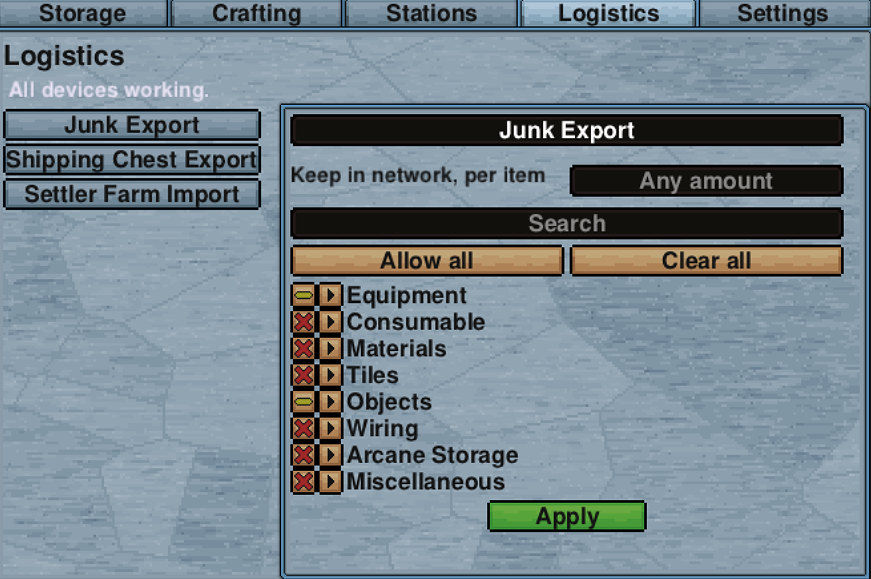
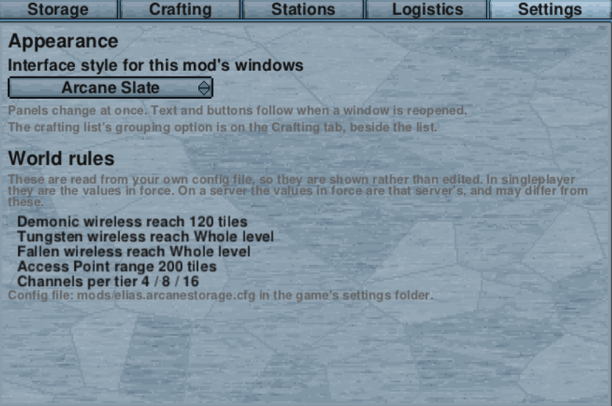

# The terminal

The Storage Terminal is the screen you open. It has five tabs across the top.

## Storage

The main grid. Every item on the network, gathered into one list, with identical stacks added together. A
stack of 200 iron bars spread across four units shows once, as 200.

**Clicking an item** takes it. **Right clicking** takes one. What you click is the item, not a position, so
searching or sorting can never make a click land on the wrong thing.

The controls, from left to right along the bottom row:

- **Deposit all** puts your whole inventory into the network, except for slots you have pinned and except for
  your hotbar when the hotbar is locked. Locking your hotbar is how you tell the game that arrangement is
  deliberate, so this button respects it.
- **Quick stack** adds only to stacks the network already has, so it tops up your ores without also swallowing
  your tools.
- **Restock** does the reverse and refills stacks you already carry.
- **Sort** cycles three orders and shows which one is active as a letter in the corner of the button. **G**
  groups by category, the same order the game's own inventory sort button produces. **A** is alphabetical by
  name. **#** puts the largest stacks first. Your choice is remembered between sessions.
- **Show** cycles what the grid includes and also marks itself in the corner. No mark means everything. **+**
  shows only items that stack, which is your materials. **1** shows only items that do not stack, which is
  your gear. This one resets every time you open the terminal, on purpose, because a terminal that opened
  already filtered would look empty and broken.

Above the grid:

- **The search box.** Type and the grid narrows as you type. Nothing is sent anywhere, so it is instant.
- **The category picker.** Choose one category to show. Arcane Storage has its own entry, so you can see
  just this mod's blocks.
- **The item count**, on the right, tells you how many entries the grid is showing. It exists so you can tell
  "the network has none of these" apart from "a filter removed them all".
- **The capacity bar** shows slots used across the whole network. It changes colour as it fills.

If a bus somewhere has a problem, a short warning appears on this row. Hover it for the detail. It is here
because the terminal is where you come when storage misbehaves, and a greyed out bus behind a wall is not
something you can spot.

## Crafting

Every recipe the network can make, from the stations you have installed in Station Units. Materials come from
anywhere on the network.

- **The recipe list** groups into collapsible sections by category. If you prefer one flat list, there is a
  tick box beside the list to turn grouping off.
- **Search** works here too, over recipe names.
- **Only craftable** hides anything you cannot afford right now.
- Selecting a recipe shows its ingredients and how many of each you have.

Recipes appear as soon as their station is installed and disappear when it is removed, without needing the
terminal reopened.

## Stations

What is installed, and where. Each Station Unit on the network is listed with the stations in it.

If this tab tells you to place a Station Unit, the network has none, or none that is connected.

## Logistics

Every bus on the network, with what it is doing. This is where you name a bus and set its rules. See
[Buses](buses.md).

## Settings

- **Interface style** switches between the two themes this mod ships and the game's own. Panels change
  immediately and text follows when a window is reopened.
- **World rules** shows the wireless reach, the access point range and the channels per tier. These are shown
  rather than edited because they come from a config file. In singleplayer they are the values in force. On a
  server the values in force are that server's, which may differ from what your own file says.
- The file itself is `mods/elias.arcanestorage.cfg` in the game's settings folder, and it is created for you
  with sensible defaults the first time the mod runs.
