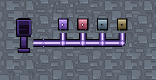
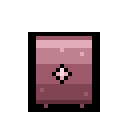
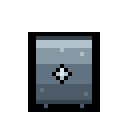
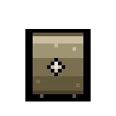
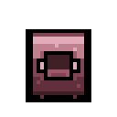
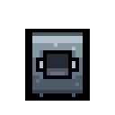
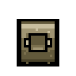
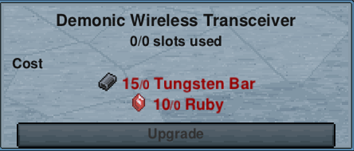
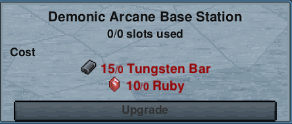
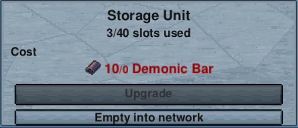

# Tiers

Storage Units, Station Units, Wireless Transceivers and Base Stations all upgrade through four rungs. They
follow the same ladder the game's own crafting stations use, so each upgrade lands when you are already
upgrading everything else.

| Rung | Crafted at | Signature material |
|---|---|---|
| Base | [Workstation](https://necessewiki.com/Workstation) | Logs and [Iron Bar](https://necessewiki.com/Iron_Bar) |
| Demonic | [Demonic Workstation](https://necessewiki.com/Demonic_Workstation) | [Demonic Bar](https://necessewiki.com/Demonic_Bar) |
| Tungsten | [Tungsten Workstation](https://necessewiki.com/Tungsten_Workstation) | [Tungsten Bar](https://necessewiki.com/Tungsten_Bar) |
| Fallen | [Fallen Workstation](https://necessewiki.com/Fallen_Workstation) | [Upgrade Shard](https://necessewiki.com/Upgrade_Shard) |

All four rungs are visibly different colours, so a glance along a conduit run tells you what you have:

## Storage Units

Each rung doubles the slots.

| Rung | Sprite | Slots |
|---|---|---|
| Base |  | 40 |
| Demonic |  | 80 |
| Tungsten |  | 160 |
| Fallen |  | 320 |

For comparison, a vanilla chest holds 40 stacks, so a base Storage Unit is one chest and a Fallen unit is
eight of them in one tile.

## Station Units

Each rung doubles the number of crafting stations you can install.

| Rung | Sprite | Stations |
|---|---|---|
| Base |  | 1 |
| Demonic |  | 2 |
| Tungsten |  | 4 |
| Fallen |  | 8 |

## Wireless

The Wireless Transceiver and Base Station start at Demonic rather than base. See
[Reaching further](wireless.md) for what each rung buys. They upgrade from their own panels the same way:

 

## Upgrading an existing unit

You do not have to break a unit and lose its contents. Click a unit and its panel has an upgrade button.
Upgrading in place keeps everything inside.

An upgrade costs the tier's material, and the panel tells you exactly what before you commit.

## Moving a unit

The same panel has an **empty** button. It moves everything in that unit into the rest of the network, so you
can then break the unit and put it somewhere else.

It reports what happened in chat every time, including when nothing moved, so you are never left guessing
whether the button worked. If the rest of the network cannot hold everything, it moves what it can and tells
you what is left.

Breaking a full unit was never destructive. Its contents drop on the floor like any chest. The empty button
just saves you picking up forty stacks in a place where anyone walking past can pick them up first.
