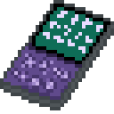
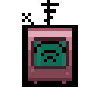
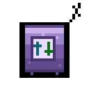
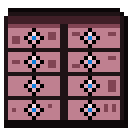

# Reaching further

Conduits are cheap but they have to be laid tile by tile. Two other things let a network cover ground without
a line on the floor. Both start at the Demonic tier, because before that a storage network is still small
enough to walk across.

## Wireless Terminal

An item you carry. Use it and the terminal screen opens wherever you are.

It has to be paired with a Wireless Transceiver first. Hold the terminal and click a transceiver to pair
them. After that, using the terminal opens the network that transceiver is on.

## Wireless Transceiver

Placed on the network, and it is what a Wireless Terminal connects to. One is enough for a base.

How far away you can be depends on the tier:

| Tier | Reach |
|---|---|
| Demonic | 120 tiles, on the same island |
| Tungsten | The whole island, however far you have walked |
| Fallen | Any island, including caves and incursions |

Those numbers are the defaults and a server can change them. The terminal's Settings tab shows what your own
config says.

## Access Point and Base Station

These two are a pair, and they solve a different problem. A Wireless Terminal brings **you** to the network.
An Access Point brings **distant storage** onto it.

Put a **Base Station** on your main network. Put an **Access Point** next to storage somewhere else, up to 200
tiles away, and tune it to one of the base station's channels. That storage is now part of the main network,
exactly as if you had run conduit to it.

It behaves the same as conduit in every way. The items show up in your terminal, they count towards capacity,
crafting can use them, and a Station Unit out there works too.

Each channel carries one Access Point, so the number of channels is the number of separate outposts a Base
Station supports:

| Tier | Channels |
|---|---|
| Demonic | 4 |
| Tungsten | 8 |
| Fallen | 16 |

The typical use is one channel per outbuilding. Grain by the farm, ore by the mine, timber by the trees, and
one spare.

## Which one do I want

- You want to check your storage while out exploring. That is a **Wireless Terminal**.
- You want the chest at your farm to be part of your main network. That is an **Access Point** and a **Base
  Station**.
- Your storage is all in one place and you are happy walking to it. You need neither. Conduit is cheaper.

## Costs

At the [Demonic Workstation](https://necessewiki.com/Demonic_Workstation) and its later versions:

| Item | Demonic | Tungsten | Fallen |
|---|---|---|---|
| Wireless Terminal | 10 Demonic Bar, 5 Sapphire | 10 Tungsten Bar, 5 Ruby | 10 Upgrade Shard, 5 Pearlescent Diamond |
| Wireless Transceiver | 15 Demonic Bar, 10 Sapphire | 15 Tungsten Bar, 10 Ruby | 15 Upgrade Shard, 10 Pearlescent Diamond |
| Base Station | 15 Demonic Bar, 10 Sapphire | 15 Tungsten Bar, 10 Ruby | 15 Upgrade Shard, 10 Pearlescent Diamond |

The Access Point has only one version, because there is nothing a tier could buy it. It costs 40 Any Log, 10
Iron Bar and 1 [Sapphire](https://necessewiki.com/Sapphire) at a Workstation.
